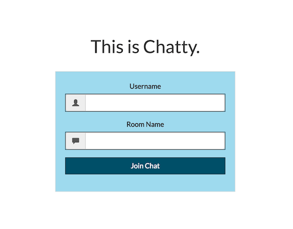

# Chatty

Welcome to Chatty - an interactive chat application.

<div style="box-shadow: 0 12px 15px 0 rgba(0,0,0,0.24),0 17px 50px 0 rgba(0,0,0,0.19);"><a href="https://nodejs-chatty.herokuapp.com/" alt="Conscioux.com"><center></center></a></div>

## Getting Started Locally

```
git clone git@github.com:sanlouise/sockets.git

cd sockets

npm init

npm install --save express moment socket.io
```

Your app will now be running on [localhost:3000](http://localhost:3000).

## Contributing

1. Fork the repo
2. Create your feature branch:

`git checkout -b my-new-feature`

3. Commit your changes:

`git commit -am 'Add some feature'`

4. Push to the branch:

`git push origin my-new-feature`

5. Submit a pull request and get listed as a contributor!

## History

TODO: Write history

## Credits

* [sanlouise](https://github.com/sanlouise)

## License

[MIT License](LICENSE).
